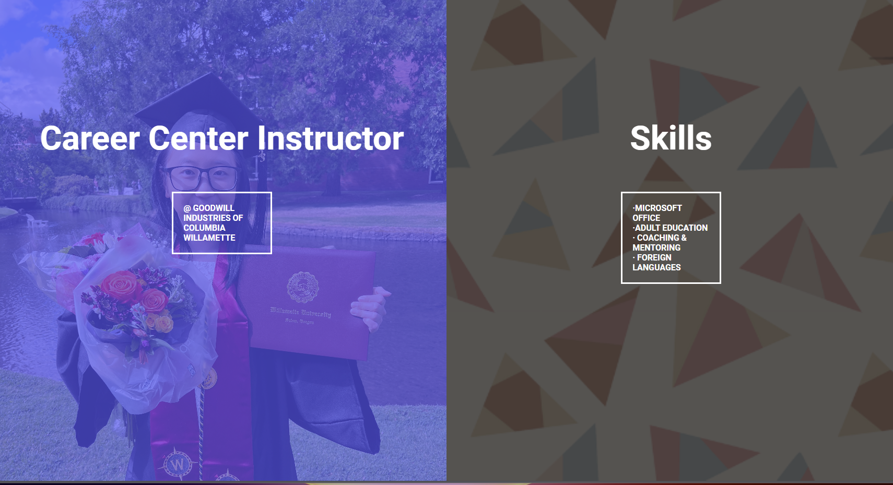
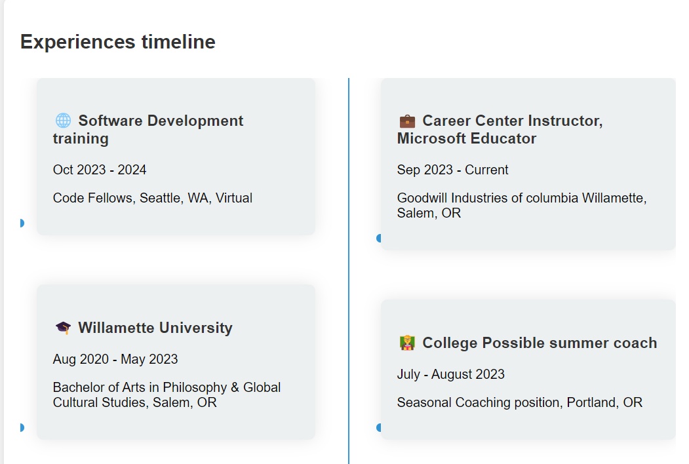

# Split Landing Page

## Overview

Welcome! This project showcases a split landing page inspired by the [50 projects 50 days repository](https://github.com/bradtraversy/50projects50days/tree/master). The page serves as an interactive introduction to my web resume(click on boxes to get there), highlighting my career and skills. Hover over either side of the screen to explore more about my professional background and expertise.

## [Live Demo](https://qilinxie02.github.io/resume/)

## Features

- **Interactive Split Landing Page:** The page is divided into two sections that highlight my career and skills.
- **Dynamic Hover Effects:** Hovering over either section reveals more information and adds a stylish transition effect.
- **Redirect Links:** Clicking on each section will redirect you to my detailed web resume page with timelines.
- **Responsive Design:** The page is designed to be responsive and works well on various screen sizes.

## Technologies Used

- **HTML**
- **CSS**
- **JavaScript**
- **Font Awesome**

## Usage

1. **Hover Effects:**
   - Hover over the left section to highlight my career.
   - Hover over the right section to highlight my skills.
   
2. **Redirections:**
   - Click on the left section to be redirected to my career timeline at Goodwill Industries of Columbia Willamette.
   - Click on the right section to view my skills and detailed resume timeline.

When you click on the boxes on both side, it will redirect you to my web resume page with timelines: 

